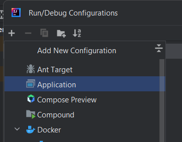

# URL Shortener
The "URL Shortener" project is a web service developed to convert long URLs into short ones. The user enters a long URL, and our service provides them with a unique shortened URL, which automatically redirects to the original long URL when accessed.
## Content
- [Technologies](#technologies)
- [Environmental Variables](#environmental-variables)
- [Start of work](#start-of-work)
- [Testing](#testing)
- [Deploy and CI/CD](#deploy-and-cicd)
- [To do](#to-do)
- [Improvements](#improvements)
- [Project Team](#project-team)
# Technologies
 + Spring Boot
 + Spring Data
 + PostgreSQL
 + JWT
 + FlyWay
 + Swagger
 + jUnit5
 + Mockito
 + CI pipeline (GitHub actions)
 + Docker
 + docker-compose
## Environmental Variables
### PostgreSQL Database Configuration
- ```POSTGRES_DB_USERNAME:``` The username for accessing the PostgreSQL database. Default value: ```postgres```.
- ```POSTGRES_DB_PASSWORD:``` The password for the root user of the PostgreSQL database. Default value: ```1234```.
- ```POSTGRES_DB_NAME:``` The name of the PostgreSQL database to be used. Default value: ```url_shortener```.
- ```POSTGRES_DB_LOCAL_PORT:``` The local port number to access the PostgreSQL database. Default value: ```5433```.
- ```POSTGRES_DB_DOCKER_PORT:``` The port number used by the PostgreSQL Docker container. Default value: ```5432```.
### Spring Application Configuration
- ```SPRING_LOCAL_PORT:``` The local port number to access the Spring application. Default value: ```8080```.
- ```SPRING_DOCKER_PORT:``` The port number used by the Spring application Docker container. Default value: ```9999```.
## Start of Work
### Creating Production Application Image
```java, -jar, opt/UrlShortenerApplication.jar```
### Deploying application & Database into containers
```docker-compose up```
### Stop & remove container
 - ```docker stop```
 - ```docker rm```
### Removing all containers
```docker-compose down```
## Testing
## Deploy and CI/CD
## To do
### Main Requirements:
 - [x] The project must be implemented as a REST API.
 - [x] The project must be presented in the form of API documentation (Swagger).
 - [ ] The API must have versioning: [https://www.baeldung.com/rest-versioning](https://www.baeldung.com/rest-versioning).
 - [ ] Code coverage with tests: at least 80%.
### Requirements for Launch:
 - [ ] There must be two launch profiles, default and prod [https://www.baeldung.com/spring-profiles](https://www.baeldung.com/spring-profiles).
 - [ ] The default profile should have settings for local launch.
 - [ ] Prod for a remote server.
 - [x] The application must have a Dockerfile, and the local launch of the application (application + database) must be described in docker-compose.yml.
 - [ ] The database for tests must be launched using [https://java.testcontainers.org/](https://java.testcontainers.org/).
 - [x] All private information, such as login and password to the DB, must be in the form of environment variables: ```${DB_USERNAME}```.
 - [x] Environment variables must be described in the README.md file.
#### 1. Registration and Authentication of Users
##### Registration:
 - [x] Check for the uniqueness of the username.
 - [x] The password must contain at least 8 characters, including numbers, uppercase and lowercase letters.
 - [x] Storage of passwords in encrypted form.
##### Authentication:
 - [ ] Verification of entered data for correspondence with the data in the DB.
 - [ ] Upon successful authorization, return a JWT (JSON Web Token) that will be used for further authentication.
### 2. Short Link
 - [x] Must contain a short link, original, creation date, the number of transitions made on it, and the user who created it.
 - [x] The link must have an expiration date.
### 3. Creation of a Short Link
 - [ ] Only a registered user can create a short link.
 - [ ] The original link must be valid.
 - [ ] The system must generate a new short link (6-8 random letters/numbers).
 - [ ] The short and original links must be saved in the DB according to the user.
### 4. User Capabilities
 - [ ] The user must be able to view all created active links and statistics on them.
 - [ ] The user must be able to view all created links and statistics on them.
 - [ ] The user can create a new/delete an existing link.

### 5. Following the Link
 - [ ] Even an unregistered user can follow the shortened link.
 - [ ] The transition statistics must be updated.
 - [ ] The response must be cached.
## Improvements
 - [x] Implement a global exception handler using ```@ControllerAdvice``` and ```@ExceptionHandle``` annotations to manage exceptions across the entire application.
 - [ ] Thymeleaf Integration: Thymeleaf should be used as the server-side template engine for rendering HTML content.
## Project Team
 - Team Lead [Antonii Viazovskyi](https://github.com/AntoniiViazovskyi)
 - Scrum Master [Vitalii Bahrynovskyi](https://github.com/bagrik571)
 - Developer [Dmytro Ilin](https://github.com/Dmitriy2028)
 - Developer [Viktor Kudryavtsev](https://github.com/vikadmin88)
 - Developer [Oleksii Bielov](https://github.com/Belimbb)
 - Developer [Katerina Zharchynska](https://github.com/Zharch1541)
 - Developer [Maryna Yeretska](https://github.com/MNN1107)
 - Developer [Oleg Gordienko](https://github.com/Holmc555)
Нужно зайти в папку с проектом и открыть из нее командную строку.
Из нее выполнить команду:  
`docker build -t goit-proj .`

после того как проект сбилдится надо выполнить команду:  
`docker-compose up -d`

чтобы создать разные профили надо в верхнем меню выбрать подпункт edit configurations


затем выбрать add new configuration и выбрать пункт application


при создании профиля имя переменной окружения должно совпадать с именем переменной свойств которая будет использоватся с этим профилем 

